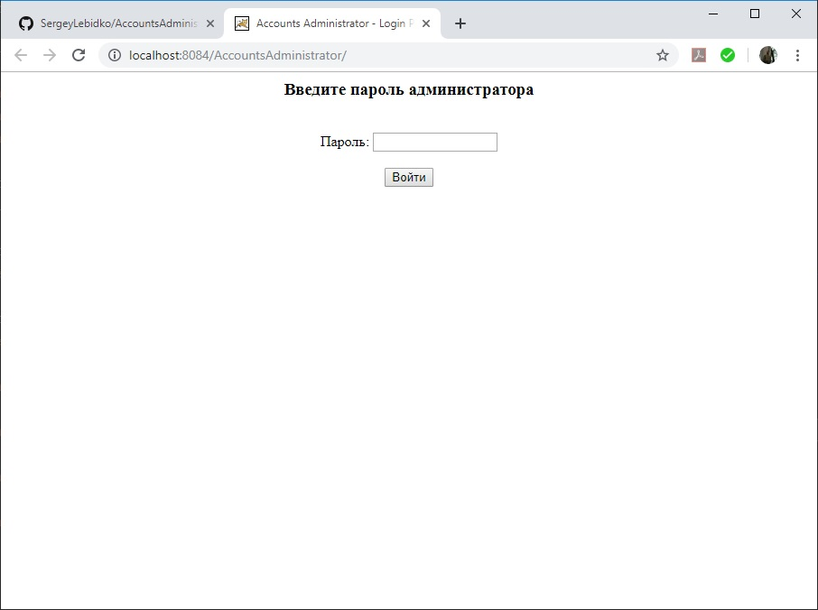
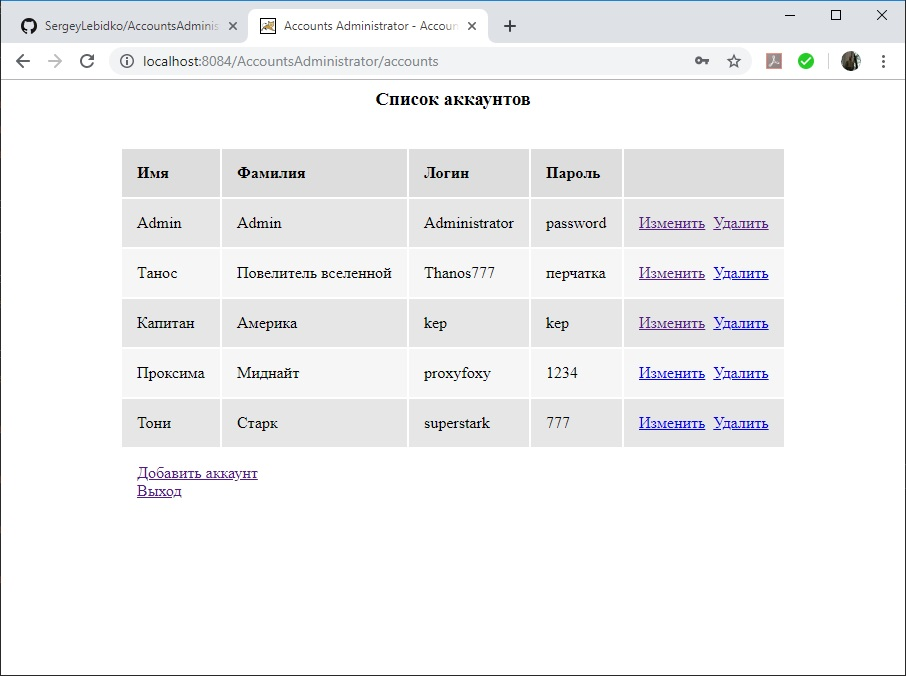
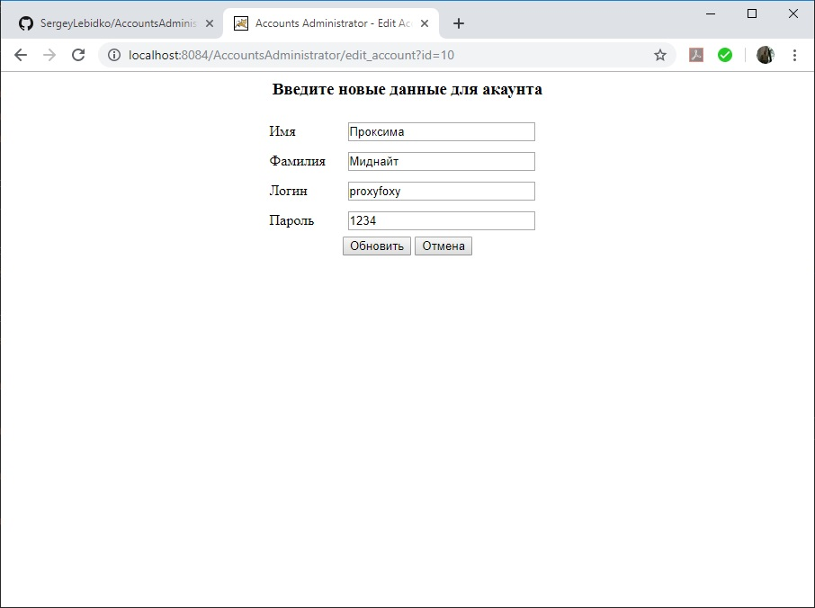

# AccountsAdministrator

Мой первый опыт в написании web-приложения на java. Программа имитирует систему управления учетными записями пользователей. Администратор учетных записей входит в систему под своим паролем, затем может создавать новые учетные записи, модифицировать или удалять уже имеющиеся.
Система отслеживает уникальность логинов для учетных записей. Также не дает удалить учетную запись самого администратора.

Состав классов следующий:
Сервлеты:
Login - позволяет администратору войти в ситему. Устанавливает особый флаг в контексте сервлетов, сигнализирующий другим сервлетам о том,         что администратор успешно залогинился и работа в системе разрешена.
Logout - закрывает возможность работы с системой до повторного ввода пароля администратора.
AccountsList - выводит список аккаунтов
AccountsCreator - позволяет создавать новые аккаунты
AccountsEditor - позволяет редактировать данные аккаунтов
AccountsRemover - служит для удаления аккаунтов

База данных системы размещается на отдельно на локальном диске. Предполагается, что в папке C:\database
Единственная таблица базы данных (ACCOUNTS) создана с помощью такого скрипта:

CREATE TABLE "ACCOUNTS" (
	"ID"	INTEGER NOT NULL PRIMARY KEY AUTOINCREMENT,
	"FIRST_NAME"	TEXT NOT NULL,
	"LAST_NAME"	TEXT NOT NULL,
	"USERNAME"	TEXT NOT NULL UNIQUE,
	"PASSWORD"	TEXT NOT NULL
);

Скриншоты ниже:

